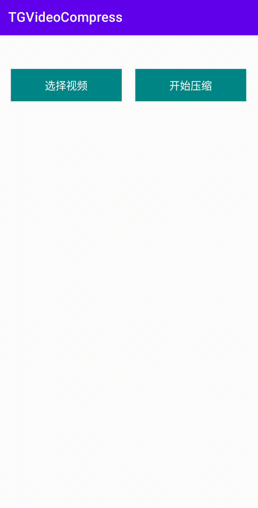

# TG视频压缩

[中文](https://github.com/viifo/TGVideoCompress/blob/master/README.md) | [English](https://github.com/viifo/TGVideoCompress/blob/master/README_en.md)

基于 Telegram for Android 11.1.3 (5244) 的视频压缩库，由 [**Telegram for Android**](https://github.com/DrKLO/Telegram) [](https://github.com/DrKLO/Telegram) 源代码抽取而来。



## 使用

```java
// TG 默认压缩策略
VideoEditedInfo info = MediaController.makeTgVideoEditedInfo(path);
// 开始任务，多个任务会排队依次执行
MediaController.getInstance().scheduleVideoConvert(info);
// 进度回调
MediaController.getInstance().setListener(new OnProgressListener() {
    @Override
    public void progress(VideoEditedInfo info, float progress) {

    }

    @Override
    public void success(VideoEditedInfo info) {

    }

    @Override
    public void error(VideoEditedInfo info) {
        // 出错或任务被取消
    }
});

// 取消某个任务
MediaController.getInstance().cancelVideoConvert(info);
```

## License

```
Copyright 2024 viifo

This program is free software; you can redistribute it and/or modify 
it under the terms of the GNU General Public License as published by
the Free Software Foundation; either version 2 of the License, or
(at your option) any later version.

This program is distributed in the hope that it will be useful,
but WITHOUT ANY WARRANTY; without even the implied warranty of
MERCHANTABILITY or FITNESS FOR A PARTICULAR PURPOSE.  See the
GNU General Public License for more details.

You should have received a copy of the GNU General Public License along
with this program; if not, write to the Free Software Foundation, Inc.,
51 Franklin Street, Fifth Floor, Boston, MA 02110-1301 USA.
```

